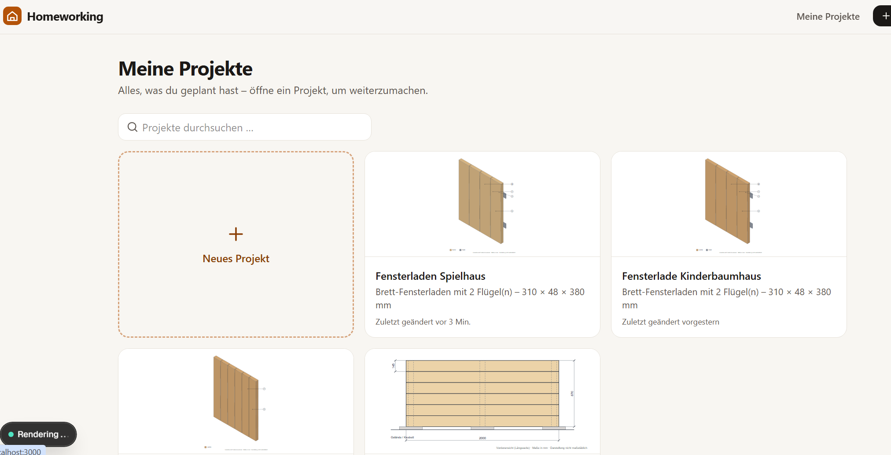

# Bug - rendering roblem

Eine Bauzeichnung kann nach mehreren Minuten nicht angezeigt werden:

Es steht nur Rendering dorten und ich kann mein altes Projekt erst nach paar Minuten sehen.
Das muss alles viel schneller gehen.
Nutze eine Engine die sehr sehr schnell ist
Außerdem sind die Erklärungen sehr dürftig. Bei Warum so? steht:
Einzel-Flügel-Laden aus 18-mm-Fichtenbrettern mit aufgeschraubten Querleisten als Z-Verstrebung. Zwei 200-mm-Ladenbänder als Scharniere je Flügel, Sturmhaken für die überdachte Außenanwendung. Outdoor-Ölfinish schützt das Fichtenholz vor Feuchtigkeit.
Das ist super aber sollte doch ein bisschen mehr sein.

